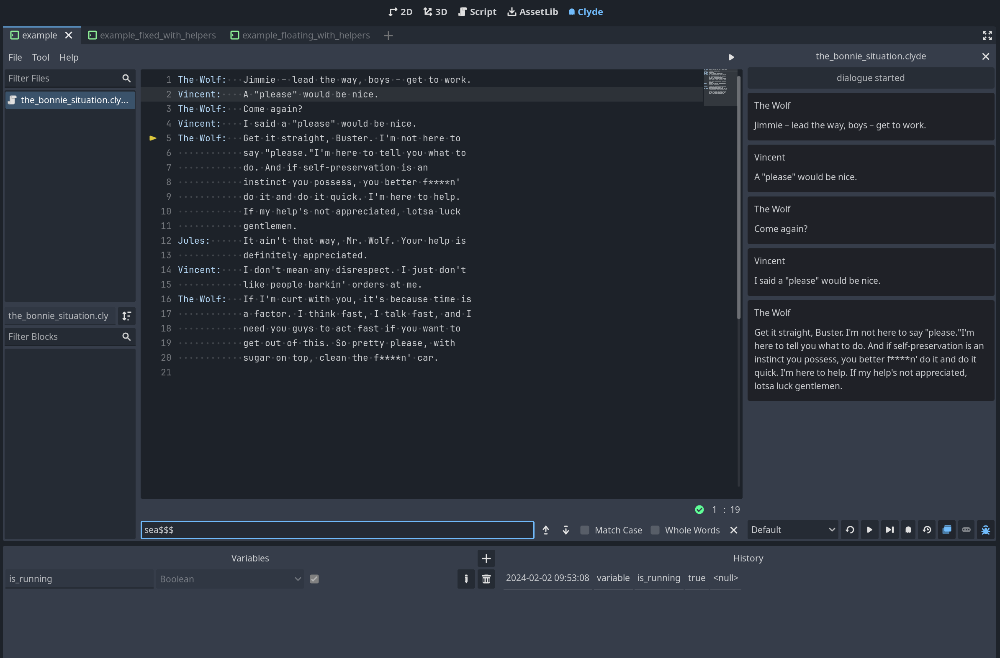

# Clyde Dialogue Plugin for Godot

Importer, interpreter and editor for [Clyde Dialogue Language](https://github.com/viniciusgerevini/clyde). Completely written in GDScript. No external dependencies.

> Clyde is a language for writing game dialogues. It supports branching dialogues, translations and interfacing with your game through variables and events.

_This branch has the source code for Godot 4. For Godot 3 check the [godot_3](https://github.com/viniciusgerevini/godot-clyde-dialogue/tree/godot_3) branch._

## Usage

The importer automatically imports `.clyde` files to be used with the interpreter. This improves performance, as the dialogue is parsed beforehand.

Check the [documentation](https://thisisvini.com/clyde/en/latest/godot/index.html) for how to use the interpreter.

You can find usage examples on [/addons/clyde/examples](./addons/clyde/examples)

For more about how to write dialogues using Clyde, check the language [documentation](https://thisisvini.com/clyde/en/latest/language/).

## Instalation

Follow Godot's [ installing plugins guide ]( https://docs.godotengine.org/en/stable/tutorials/plugins/editor/installing_plugins.html).

## Settings

Go to `Project > Project Settings > General > Dialogue`.

| Field                   | Description |
| ----------------------- | ----------- |
| Source Folder: | Default folder where the interpreter will look for `.clyde` files when just the filename is provided. Default: `res://dialogues/` |
| Id Suffix Lookup Separator: | When using id suffixes, this is the separator used in the translation keys. Default. `&`.|
| Enable Editor: | Default: true. Enable main screen dialogue editor. |
| Enable Helpers: | Default: false. Enable the `Dialogue` singleton and config node. |

## Helpers

As seen in the documentation, Clyde's interpreter has as simple interface giving you full control on how to display and handle your dialogues. However, there are many different ways you can go about it, which might make it daunting for new developers.

To help you quick start a project, I included a few helpers with this plugin. By enabling the helpers option in ProjectSettings, a `Dialogue` singleton and a `ClydeDialogueConfig` node will be available, allowing a quick start with no much effort.

You can find examples using these helpers on [/addons/clyde/examples](./addons/clyde/examples).

This implementation comes with a simple fixed dialogue bubble and a floating dialogue bubble. You can adapt these helpes however you need. If you intend to change them, I recommend copying them to your project's folder so there are no conflicts when updating the plugin.

## Contact and Help

For issues with the plugin, feel free to open an issue in this repository.

If you are looking for help on how things work, general questions, ideas or just want to share something, please use our main discussion forum: https://github.com/viniciusgerevini/clyde/discussions

I also would love to see what games you've been making with Clyde. If you have any released game using clyde, share it with us on: https://github.com/viniciusgerevini/clyde/discussions/3
